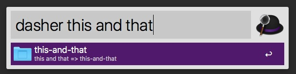

# Alfred Dummy Workflow

Provide a sufficient amount of documentation for your Alfred workflow!!!

> dasher

## Install

```
$ npm install --global @maiburg/alfred-dummy-workflow
```

*Requires [Node.js](https://nodejs.org) 4+ and the Alfred [Powerpack](https://www.alfredapp.com/powerpack/).*


## Usage

Provide a sufficient amount of documentation for your Alfred workflow!!!




## License

MIT © [Alex Maiburg](http://maiburg.com)
